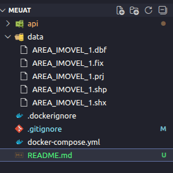
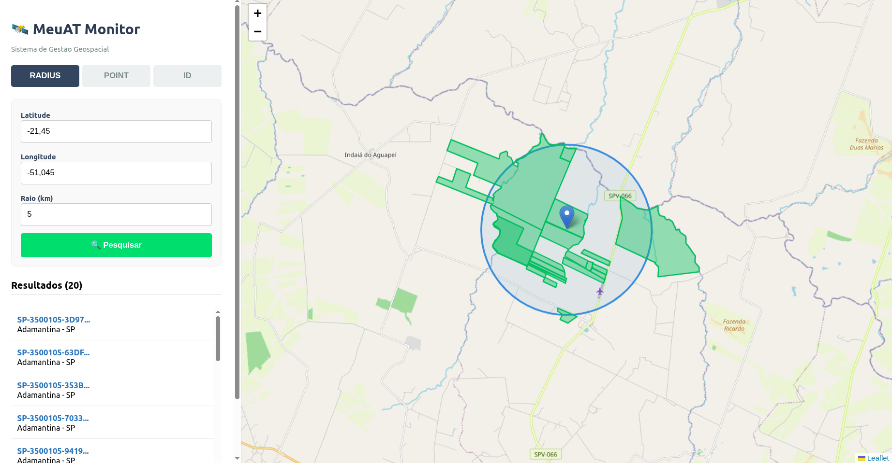

## 📥 Download dos dados

Este projeto depende de arquivos de dados geográficos que **não estão no repositório** devido ao tamanho.

### 🔗 Baixe os dados

Faça o download do arquivo no link abaixo:

👉 [Download Área Imóvel SP (Google Drive)](https://drive.google.com/file/d/15ghpnwzdDhFqelouqvQwXlbzovtPhlFe/view?usp=sharing)

### 📁 Extração

1. Extraia o arquivo `.zip` após o download.
2. Coloque os arquivos extraídos dentro da pasta: MeuAT/data

### 📁 Estrutura esperada



## ⚠️ Antes de rodar a aplicação !

No arquivo `api/scripts/seed.py`
foi definido um limite de 3000 tuplas para melhoria
do desempenho da aplicação com base no tamanho dos dados compartilhados. Esse limite
foi definido em

```python
LIMIT_ROWS = 3000  # Limit for technical test performance
```

- Você pode alterar esse limite pra qualquer numero, desde que entenda que isso intefere no tempo de execução do container

## 🚀 Como Rodar a Aplicação

A aplicação é totalmente containerizada, o que facilita o setup em qualquer ambiente. Certifique-se de que o **Docker** e o **Docker Compose** estão instalados em sua máquina.

### 1. Subindo o Ambiente

Na raiz do projeto, execute o comando abaixo. Ele irá baixar as imagens, configurar a rede, subir o banco de dados PostGIS e a API FastAPI.

```bash
docker compose up --build
```

ou

```bash
docker-compose up --build
```

Importante: Na primeira execução, o container da API iniciará automaticamente o script seed.py. Acompanhe os logs no terminal. A API e o Frontend estarão totalmente operacionais somente após a mensagem:

INFO: Processo de seed finalizado com sucesso!

### 2. após rodar o comando acima, você pode acessar

Após a inicialização dos containers:

- 🌐 **Frontend**  
  Acesse em:  
  http://0.0.0.0:8003/

- 🔌 **Backend (API FastAPI)**  
  Disponível em:  
  http://0.0.0.0:8004/

## Solução de Problemas: Porta 5432 ocupada

Caso você veja um erro indicando que a porta 5432 já está em uso, é provável que você tenha um PostgreSQL instalado localmente. Veja como liberar a porta:

### 🪟 No Windows (PowerShell como Admin)

```bash
# Encontra o processo que está usando a porta 5432
netstat -ano | findstr :5432

# Mata o processo (substitua <PID> pelo número que apareceu no comando anterior)
taskkill /PID <PID> /F
```

### 🐧 No Linux (Terminal)

```bash
# Verifica quem está usando a porta
sudo lsof -i :5432

# Para o serviço local do PostgreSQL
sudo service postgresql stop
# Ou via systemd
sudo systemctl stop postgresql
```

## 🚦 Verificação e Documentação (Swagger)

Uma vez que a aplicação esteja rodando, você pode acessar:

Documentação Interativa (Swagger): http://localhost:8004/docs

Health Check: http://localhost:8004/health (Verifica se a API e o Banco de Dados estão conectados).

## 🏗️ Arquitetura do Projeto

O projeto segue uma estrutura modular para facilitar a manutenção e escalabilidade:

- **`/api/app/models`**: Definições de tabelas ORM (SQLAlchemy + GeoAlchemy2).
- **`/api/app/schemas`**: Contratos de entrada e saída (Pydantic).
- **`/api/app/services`**: Camada de **Business Rules** (regras de negócio e validações).
- **`/api/scripts`**: Scripts de infraestrutura e automação (Seed).
- **`.github/workflows`**: Pipeline de CI (Linting + Tests).

## 🌟 Diferenciais Técnicos Aplicados

- **Logs Estruturados**: Implementação de logs em JSON para facilitar monitoramento.
- **Validação Geoespacial**: Uso de GeoAlchemy2 e PostGIS para consultas de alta performance (`ST_Contains`, `ST_DWithin`).
- **Testes Automatizados:**: Suite de testes com Pytest cobrindo endpoints de busca geoespacial.
- **Swagger Customizado**
  Documentação rica com descrições de negócio e exemplos de payloads.
- **Paginação de Resultados:**
  Implementada nos endpoints de busca para otimizar o tráfego de dados.
- **Health Check Ativo**
  Endpoint GET /health que valida a conexão real com o banco de dados.
- **Filtros Adicionais** Busca por nome da cidade e filtros de área mínima/máxima.
- **Performance Geográfica**
  Uso de índices GiST no PostGIS para consultas espaciais de alta performance.
- **CI GitHub Actions**: Pipeline automatizado no GitHub Actions validando cada Push.
- **Camada de Logic**: Separação clara entre roteamento (API) e regras de validação.
- **Documentação Otimizada**: Swagger customizado com descrições detalhadas de cada endpoint.

## Imagem da Aplicação Funcionando


